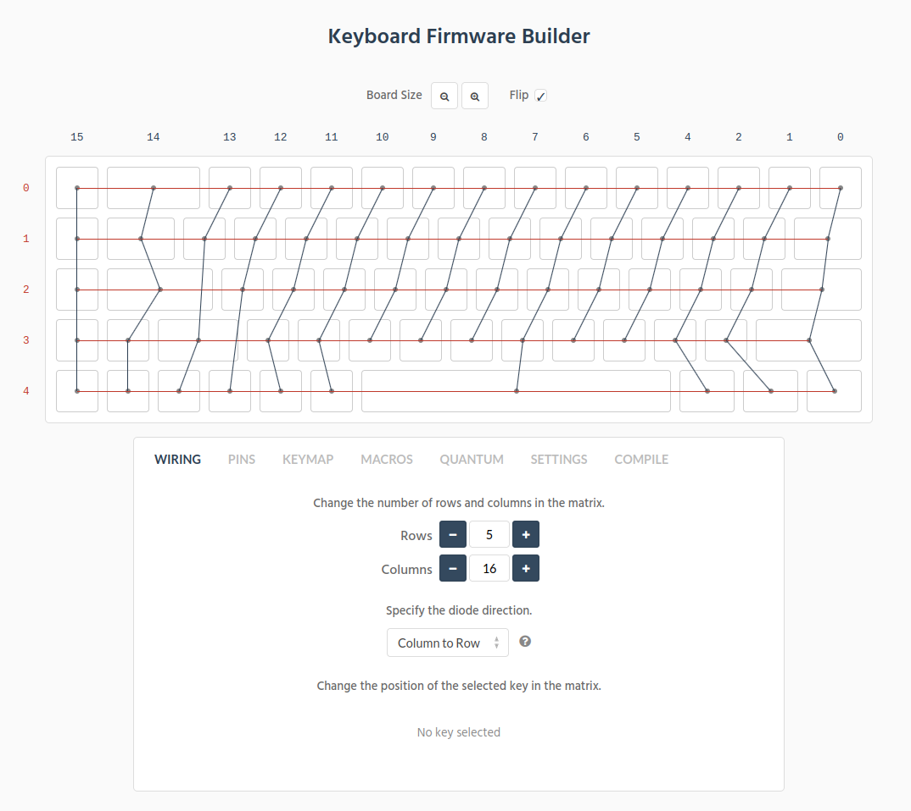

# SiCK-68 QMK Keyboard layout

This repo contains the keyboard layout that I use on my personal handwired SiCK-68 3D printed keyboard. I use a different wiring system compared to the wiring in the QMK handwired repo, which is why I made this version.

I use a teensy 2.0 for this build, but I imagine that any atmega32u4 chip will work as long as you have some way to flash this firmware.

The [SiCK-68](https://www.thingiverse.com/thing:3478494) is a 3D printed 68% keyboard case designed by FedorSosnin. 

This firmware was built using https://kbfirmware.com/. I recommend you use that website if you'd like to customize this firmware.

## Keymap editing

There is an attached layout.json file. Upload this file to https://kbfirmware.com and you can begin editing the keymap. Otherwise the keymap can be edited manually in the `keyboards/kb/keymaps/default/` folder. 

Then you simply run this command in the root directory of this project.

```
make
```

## Flashing

Once you have a .hex file, you can flash it like this:

```
sudo teensy_loader_cli --mcu=atmega32u4 -v layout.hex
```

## Wiring


